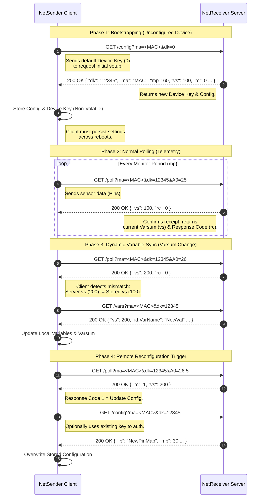

# NetSender Protocol Overview

The **NetSender Protocol** is a lightweight, HTTP-based standard designed to streamline communication between IoT devices and server implementations. It employs an architecture where clients initiate requests to three distinct endpoints handled by a **NetReceiver** service: `/config`, `/poll`, and `/vars`.

Data exchange is mostly done in http query params, and text based data formats such as JSON, to enable human readability for debugging.

## Dynamic Device control

Devices can be dynamically controlled by a NetReceiver service through [response codes](./response-codes), and [varsums](./vars#varsum-calculation). Response codes and varsums are returned by all NetSender requests, and can be used to trigger device actions, and control runtime features.

## Config
A NetSender Configuration represents the device's semi-permanent identity and baseline settings. This data is typically stored in **non-volatile memory** on the NetSender device to persist across reboots.

This is often the first step in the device lifecycle, where the configuration is fetched from the NetReceiver via the `/config` endpoint. An update of the configuration can also be triggered during the runtime of the device.

> [!Note]
> To learn more about device configuration through the CloudBlue UI, see [Device Configuration](../oceanbench/device-configuration#configuration-1).

* **Learn More:** [Config Requests](./config)

## Poll (Telemetry)
NetSender Clients operate on a polling model. They periodically report their [pin](../oceanbench/device-configuration#pins) values based on the **monitor period** defined in the device configuration.

These telemetry packets are sent to the `/poll` endpoint of the NetReceiver service. Once received, the data is ingested, processed via a virtual sensor, and visualized for the user.

* **Learn More:** [Poll Requests](./poll)

## Vars (Dynamic Settings)
NetSender Clients utilize [variables](../oceanbench/device-configuration#variables) to control runtime functions dynamically. To optimize bandwidth, the protocol uses a **change-detection mechanism**.

The client includes a `varsum` (variable checksum) in its standard poll requests. If the server detects that the client's `varsum` differs from the current version on the server, the client is triggered to perform a GET request to the `/vars` endpoint to synchronize its variables.

* **Learn More:** [Vars Requests](./vars)

---

### Summary of Endpoints

| Endpoint | Method | Purpose | Initiated By |
| :--- | :--- | :--- | :--- |
| `/config` | `GET` | Bootstrapping device settings | Client (Start-up) |
| `/poll` | `GET` or `POST` | Reporting sensor telemetry | Client (Periodic) |
| `/vars` | `GET` | Syncing runtime variables | Client (On Change) |

### Example Sequence
The following diagram shows an example sequence of a newly created device.

