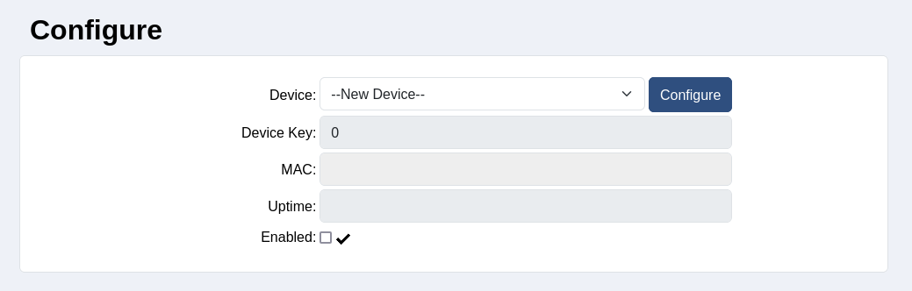
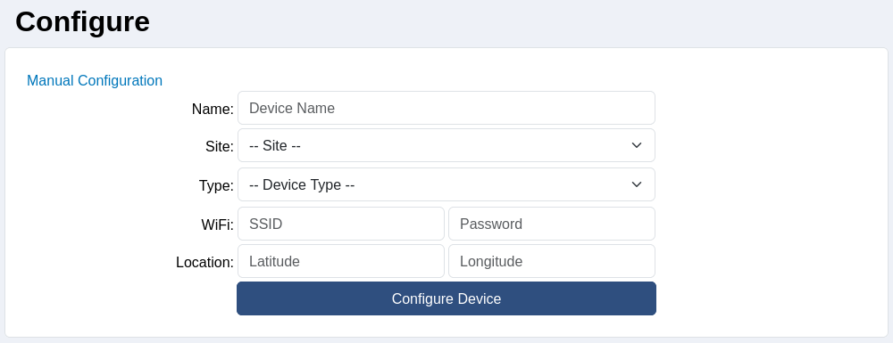

# Auto Configuration

Automatic configuration allows for devices to be configured to a default state automatically. This simplifies the process in getting a device up and running.

## Sandbox Site

The Sandbox Site is a specially defined site, which is used to hold devices whilst they are being created, and have not yet been configured and setup. To use the sandbox site effectively, you must have admin privileges to the site. When a new device is connected to the network, it will try and communicate with CloudBlue (via DataBlue), and it will be assigned a device key, and lay dormant on the sandbox site.

## Auto Configuration Steps

> [!NOTE]
> For these steps to work, the device to be calibrated needs to be on the sandbox site. If it is not on the sandbox site, use the utilities page to move it to the sandbox site.

1. To configure the device, select the sandbox site from the site-selection widget, this will redirect you to the configuration page.

2. On the configuration page, select the device to be configured. The device will list when it was created, and this should help identify the device. If you are unsure, the MAC can also be cross-checked after selection.
3. Press the Configure button. This will take you to the next step where the device can be customised based on its type, location, and WiFi connection.

4. To complete the configuration, at least the device name, site, and device type must be set. All other fields are optional, however, it is encouraged to assign them now. Once the fields have been filled out, press Configure Device.
5. This will set the default values for the given device type, move the device to the selected site, and redirect to the device page for the newly created device.
