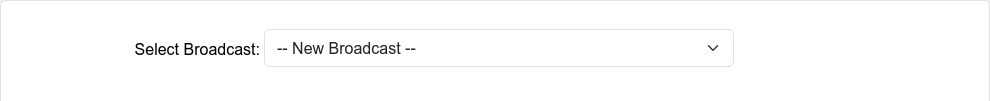
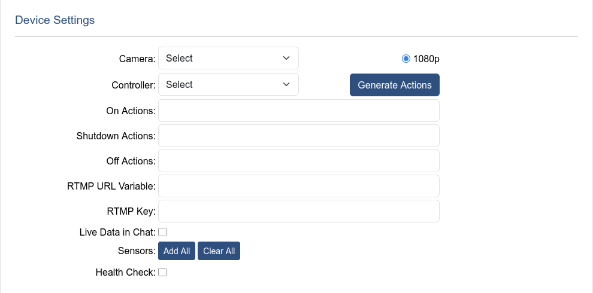

# Selecting a Broadcast

The dropdown at the top of the page allows for the selection of an existing broadcast, or the option to create a new broadcast.

# Stream Settings

The Stream Settings section controls the basics of how the stream appears on YouTube. Including, title, description, privacy, and scheduled times.

|Name|Descritption|
|---|---|
| Broadcast Name | Unique identifier for a broadcast, and will be used as the broadcast title on YouTube (with the current date appended) |
| Enabled Toggle | Toggles whether OceanTV will attempt to start the broadcast |
| Failure Mode Toggle | Toggled by OceanTV when a failure occurs that has prevented the broadcast from starting. Should be untoggled when the issue has been resolved |
| Channel | Displays the channel to stream to |
| Live Privacy | Privacy of the broadcast whilst live |
| Post Live Privacy | Privacy of the broadcast once the broadcast completes |
| Description | Description used for the YouTube broadcast |
| Stream Name | Name used on the backend to identify the broadcast source. Commonly the same as the broadcast name for simplicity |
| Start Date / Time | Time of day to start the broadcast (The date is not important, but must be set to something) |
| End Date / Time | Time of dat to complete the broadcast (The date is not important, but must be set to something) |
| Timezone | Displays the timezone of the site as reference for the broadcast schedule |
| Broadcast State | Displays the current state of the broadcast |
| Hardware State | Displays the current state of the hardware |
| Hardware State Data | Displays information used in hardware sub-states |
| Reset States | Removes any current state data, hard-resetting the broadcast |

# Device Settings

The Device settings sections handles the devices used for broadcasting, including how to power them on, shut the down, and de-power them.

|Name|Descritption|
|---|---|
| Camera | Dropdown selection menu to choose which camera on the site to use for the broadcast |
| Controller | Dropdown selection menu to choose which controller on the site to use for the broadcast |
| Generate Actions | A button which will automatically populate the default actions (On, Shutdown, and Off) as well as the RTMP URL Variable, for the devices based on the above dropdown selections |
| On Actions | Variable settings which occur at the start of the broadcast to power on devices, and set them to stream. Also used during power cycling |
| Shutdown Actions | Variable settings which occur at the completion of a broadcast to gracefully shut the camera device down, these actions happen before Off Actions. Also used during power cycling |
| Off Actions | Variable settings which occur at the completion of a broadcast after shutdown actions to de-power the camera. Also used during power cycling |
| RTMP URL Varible | Device Variable to set the RTMP key |
| RTMP Key | Auto-filled field which displays the RTMP key used to broadcast to YouTube |
| Live Data in Chat | Feature which comments data from selected sensors in the YouTube live chat |
| Health Check | Check which periodically ensures that the broadcast to YouTube is healthy and restarts the stream otherwise |
