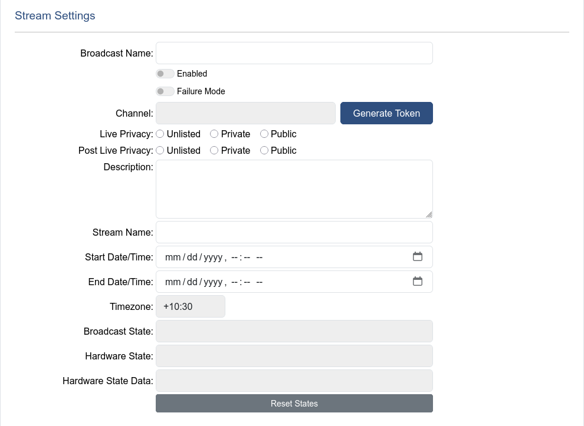

# Failure Mode

The failure mode toggle indicates that an issue has occurred during a broadcast, most typically during the starting of a broadcast. The issue must have prevented the broadcast from starting, or restarting to fix an issue multiple times, as OceanTV allows for 3 retries before entering failure mode.

## Fixing the Fault

Failure mode should only be entered by the broadcast if something has actually gone wrong in the broadcast. This should pick up configuration errors, faulty connections, flat batteries, and dead hardware. If a broadcast has gone into failure mode, start by trying to identify the fault, and fix it before removing the broadcast from failure mode. Broadcasts can end up in failure mode due to timing issues occasionally so if no fault can be found, the broadcast can be removed from failure mode.

## Removing the Broadcast from Failure Mode

To remove a broadcast from failure mode, start by untoggling the failure mode toggle switch, and then press the reset states button in the stream settings section. This should cause a hard reset for the broadcast and have the best chance starting the broadcast successfully.

> [!WARNING]
> There is no transition out of some failure states, and failing to use the reset states function may prevent the broadcast from starting, even if a fault has been fixed.
