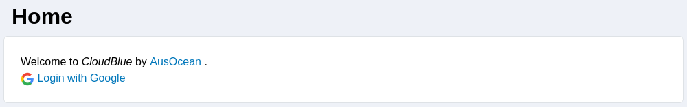
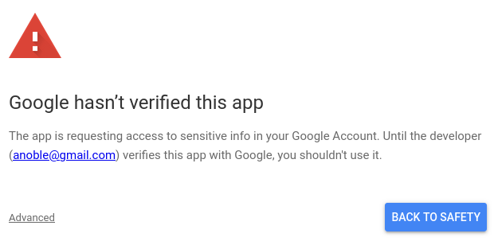

# Selecting a YouTube Channel

AusOcean's broadcasting software is primarily designed for streams to be sent to AusOcean's YouTube channel, and new broadcasts will be sent here by default. With a CloudBlue Ultimate plan, users can select a YouTube channel of their own to send broadcasts to.

The following steps describe how to setup streaming to a different YouTube channel.

1. Log into CloudBlue using the email attached to your YouTube account.

2. Using the site menu, select the site to broadcast from, and navigate to the broadcast page.
3. Select the broadcast from the dropdown at the top of the page.
4. Click the "generate token" button.

> [!WARNING]
> Only generate one token. Generating more than one will break the software.
5. Login with the email again when prompted. There is a workaround whilst the app is being verified that requires the use of advanced options to allow the software to work. Select advanced, and continue to allow CloudBlue to manage streaming to the selected YouTube channel.

6. This will return to the broadcast page, and the broadcast should now be set to stream to the selected channel.
