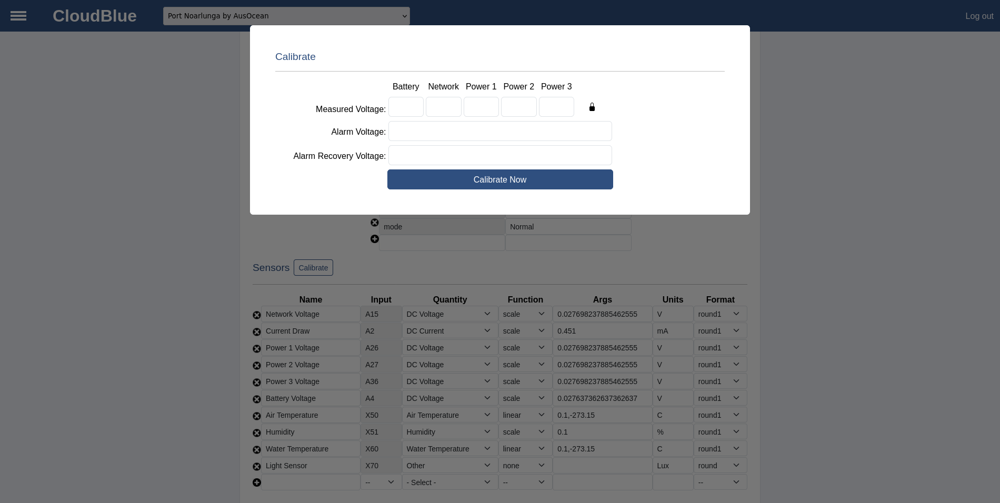

# Configuration

Devices have many settings, and configuration values which can be changed depending on what type of device it is, and what it is expected to do. A device configuration is made up by four parts.

Many of these values are standard between devices. To see how to configure a device with the default values, see [Auto Configuration](/oceanbench/autoconfiguration).

## Configuration

The configuration of a device are the persistent settings that are stored by a device, that govern the overall function of the device. These settings do not need to be changed often, and can sometimes stop the device from functioning if set incorrectly. Some of the fields of the configuration are immutable, and cannot be changed after initial configuration.

The configuration consists of the following fields:

|Field|Description|
|---| ---|
|**Name**|User-friendly name of the device|
|**MAC**|Unique MAC of the device (Immutable)|
|**Type**|Type of device (_camera, hydrophone, controlller..._)|
|**Inputs**|Pin names that are _read_ by the device|
|**Outputs**|Pin names that are _written_ to by the device|
|**WiFi**|Comma seperated pair of wifi credentials <_SSID,Password_>|
|**Mon Period**|Period in seconds between monitor/actuation cycles (typically 60 seconds)|
|**Act Period**|Period in seconds that the device is not sleeping|
|**Client Version**||
|**Client Protocol**|Software version as reported by the device|
|**Latitude**|Latitude of the device's deployment location|
|**Longitude**|Longitude of the device's deployment location|
|**Device Key**|Unique key assigned to the device on creation|
|**Local Address**|Local IP address of the device, reported by the device|
|**Last Updated**|Time at which the last update was performed|
|**Uptime**|How long the device has been continuously reporting for|

### Pins

Despite the name, pins represent more than just physical device pins. In CloudBlue, pins represent different data types. Scalar pins represent non-negative integers, with -1 signifying an error. Scalar values are sent as URL encoded parameters in the HTTP request. Vector pins represent everything else, i.e., any value that cannot be represented as a single non-negative, number. Vector data is sent in the body of a HTTP POST request.

Pins may be further classified as real or virtual. Real pins, such as analog or digital (GPIO) pins, are attached to a physical device. Virtual pins, on the other hand, provide an additional layer of abstraction. For example, while a DHT22 combined temperature/humidity sensor is physically connected to a single GPIO pin, extracting useful data requires additional computation. In this case, two scalar "X" pins suffice to convey computed temperature and humidity values. A more complicated example is video where a single "V" pin represents one channel of video data.

#### Pin Naming

| Name | Type | Description | Example usage |
|---| ---|---|---|
| A | Scalar | Analog value | A0 for battery voltage |
| B | Vector | Binary data | B0 for binary accelerometer data |
| D | Scalar | Digital value | D0 for alarm power |
| S | Vector | Sound (audio or sonar) data | S0 for first audio channel |
| T | Vector | Text (log or GPS) data | T0 for log data |
| V | Vector | Video data | V0 for first video channel |
| X | Scalar | Software-defined sensor value | X10 for ESP32 raw analog value |

#### Pin Numbering
By convention, pin numbers start from 0, not 1. For example, A0 is the first analog output (or only analog output in the case of the ESP8266), V0 is the first video channel, etc. Log data is typically reported as the first text output, namely T0, and GPS data, if present, is reported as T1.

## Variables

In addition to a site's configuration information, users may define variables to represent state. A OceanBench variable is simply a string. Boolean variables are variables for which a value of "1", "true" or "on" is treated as logical true. A value of "0", "false" or "off" is logical false, as is a variable that is not defined.

When variables are mapped onto actuator pin ervalues, logical true is sent as integer 1 and false as integer 0. Other integers are sent as is.

### Special Variable

There is a special variable _mode_ which represents the devices operating mode. Clients may set arbitrary values for the mode but conventionally Normal signifies the default mode and Paused signifies that the client is paused in some way (case sensitive). The mode value can be set by both the device, and the user.

## Sensors

Sensors transform raw pin values into useful measurements, including binary data. CloudBlue includes a number of built-in functions to make this easy. These generally take comma-separated values of floating-point numbers. Additional custom functions can be defined in code, in which case the single argument is the name of the function that performs the custom transformation.

|Name|Args|fn(x)|
|---|---|---|
|none||x|
|scale|a|a * x|
|linear|a,b|a * x + b|
|quadratic|a,b,c|a * x2 + b * x + c|
|custom|fn|fn(x)|

## Actuators

Actuators are the output of a device. An Actuator can write a value to a digital pin on a device, based on the associated variable. Actuators are commonly used by a controller to control relays, but writing a logical high or logical low, depending on the boolean state of the variable. An actuator consists of a name, variable, and a pin to control.

## Defaults

The default configuration for different device types can be filled using the [Auto Configuration](/oceanbench/autoconfiguraion) process, or they can be manually filled based on these values.
> [!IMPORTANT]
> These values are derived from the system package and should be kept in sync.\
> **Last updated:** 4th July 2025

### Controller

These are the current default values for the configuration of a controller. This configuration is designed for an ESP32 on a Controller PCB V4 revB.

**Device Configuration**
|Field|Value|
|---|---|
|Name|_any_|
|MAC|Must match device MAC|
|Type|controller|
|Inputs|X50,X51,X60,X70,A4,A26,A27,A36,A15,A2|
|Outputs|D32,D33,D25|
|WiFi|_SSID,PASS_|
|Mon Period|60|
|Act Period|60|

**Variables**
|Name|Value|
|----|-----|
|AlarmNetworkVar|10|
|AlarmPeriodVar|5|
|AlarmRecoveryVoltageVar|840|
|AlarmVoltageVar|825|
|AutoRestartVar|10|
|Power1Var|false|
|Power2Var|false|
|Power3Var|false|
|PulsesVar|3|
|PulseWidthVar|2|
|PulseCycleVar|30|
|PulseSuppressVar|false|

**Actuators**
|Name|Variable|Pin|
|---|---|---|
| Device 1 | Power1 | D32 |
| Device 2 | Power2 | D33 |
| Device 3 | Power3 | D25 |

## Calibration

Currently calibration only exists for controller type devices, calibrating the voltage scalars, and alarm voltages. To do this, click on the calibrate button.

That will open the follow popover menu.

Measure the actual values for the measured voltage fields. In most cases, it will be acceptable to only measure the battery voltage (input screw terminals to the PCB), and use this as the calibration value for all voltages. If that is acceptable, leave the lock icon in the locked state. If each voltage needs to be calibrated independently, click on the padlock icon and leave it in the unlocked state. This will use the entered value to calibrate each voltage separately.

Enter the voltage value that the controller should enter a low voltage alarm, and the voltage which it should recover.

For any field that is left empty, this value will not be calibrated.

Once the values have been entered, click the Calibrate Now button to apply the calibration. From here, navigate to the monitor page to ensure that the calibration has applied correctly.

> [!WARNING]
> Make sure not to refresh the page after applying the calibration, as this could have unexpected results.
