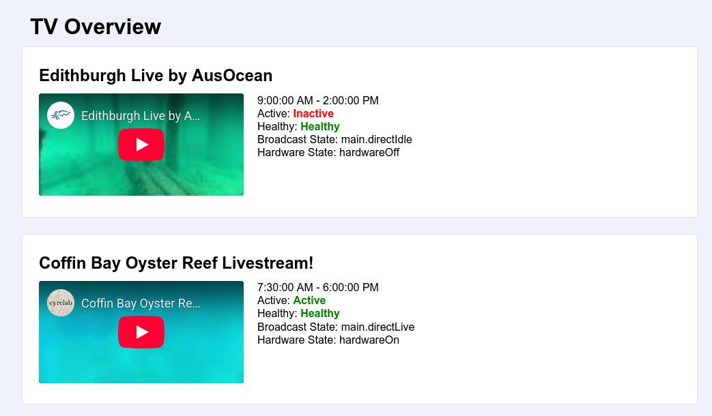

# TV Overview

The TV Overview page allows super admins to view the current status of broadcasts which they care about all in one place. The page shows when a broadcast should be lice, whether a broadcast is Active, Healthy, and the current hardware and broadcast states. The most recent broadcast is also embedded into the page.



Access to the TV Overview page requires super admin privileges, and can be accessed via the link in the footer.


## Selecting Broadcasts

To select which broadcasts the tv-overview page shows, there is a variable (tvOverviewConfig) scoped to the user's email address on site 0. This configuration variable stores a JSON encoded configuration, which is currently just a list of broadcast UUIDs. To update which broadcasts are visible, it is currently required to manually edit the configuration in the datastore. An example configuration can look like this:

```JSON
{
  "broadcasts": [
    { "UUID": "968214fe-4b55-4296-813a-8e3d76b1c828" },
    { "UUID": "28696a11-18af-4b95-9427-e7addc8677c7" },
    { "UUID": "0cb44c69-88c0-425c-bfc1-e7a10799862b" },
    { "UUID": "90be1b02-5dc2-450d-abfb-ead7a79bbd91" }
  ]
}
```
