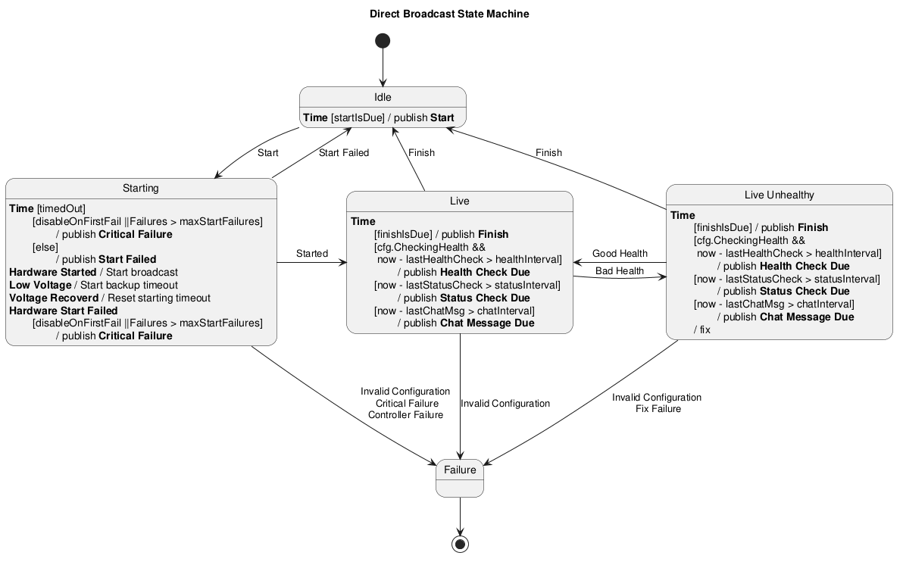

# Overview

Direct broadcasting is the most common usage of OceanTV at the time of writing. It is the simplest configuration of the OceanTV broadcast manager, where the camera sends video data directly to YouTube (or other streaming services in the future). This is primarily used for daily scheduled streams.

## Direct Broadcasting State Machine

Below is a State Diagram showing the transitions between states when broadcasting in direct mode.

## Events

Relevant event types (names are defined in `cmd/oceantv/broadcast_events.go`):

| Event | Purpose |
|---|---|
| `timeEvent{time.Time}` | Periodic clock tick used to advance the state machines and trigger scheduled checks. |
| `startEvent{}` / `finishEvent{}` | Schedule-based start and finish triggers (issued when current time is within configured start/end window). |
| `hardwareStartRequestEvent{}` / `hardwareStopRequestEvent{}` / `hardwareResetRequestEvent{}` | Requests sent to the hardware state machine to start, stop, or reset camera hardware. |
| `hardwareStartedEvent{}` / `hardwareStoppedEvent{}` | Hardware confirmations emitted when the camera begins or stops reporting (DeviceIsUp checks). |
| `startedEvent{}` / `startFailedEvent{err}` / `criticalFailureEvent{err}` | Results from broadcast start attempts: success, recoverable failure, or non‑recoverable critical failure. |
| `badHealthEvent{}` / `goodHealthEvent{}` | Health check outcomes; bad health can trigger fixes or state transitions. |
| `lowVoltageEvent{}` / `voltageRecoveredEvent{}` | Controller battery/voltage alarms used to prevent/delay starts and to trigger recovery behaviour. |
| `invalidConfigurationEvent{err}` | Configuration or sensor errors that usually disable or move the broadcast into a failure state. |
| `statusCheckDueEvent{}` / `chatMessageDueEvent{}` | Periodic maintenance triggers: status checks and scheduled chat messages. |
